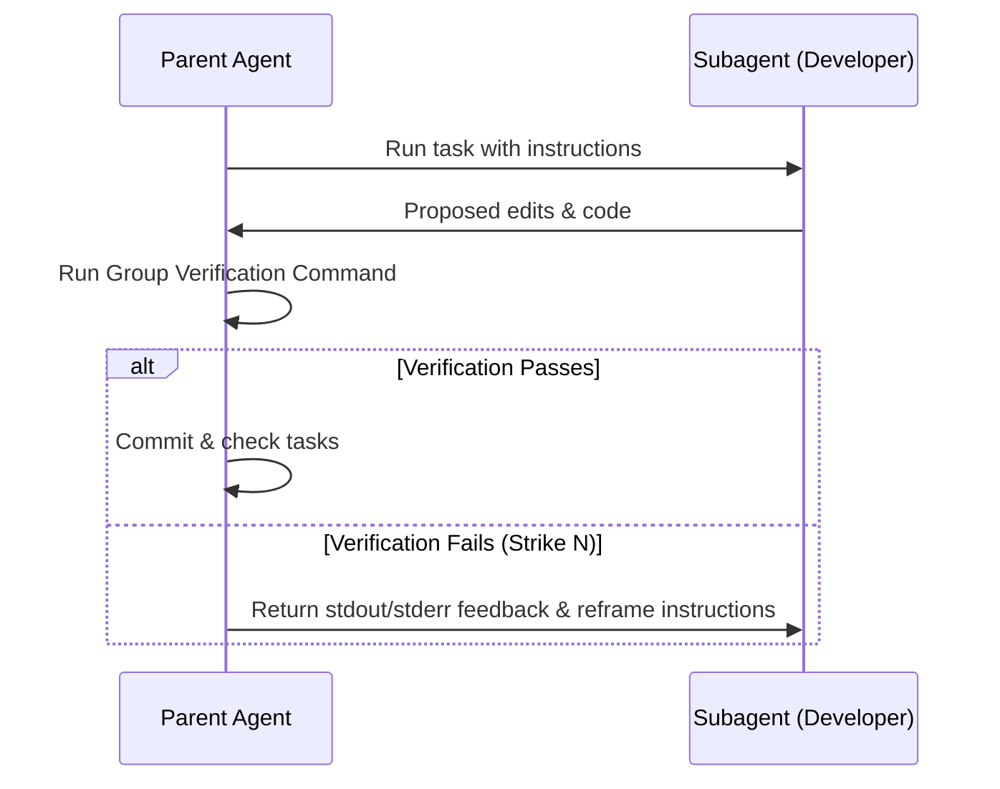
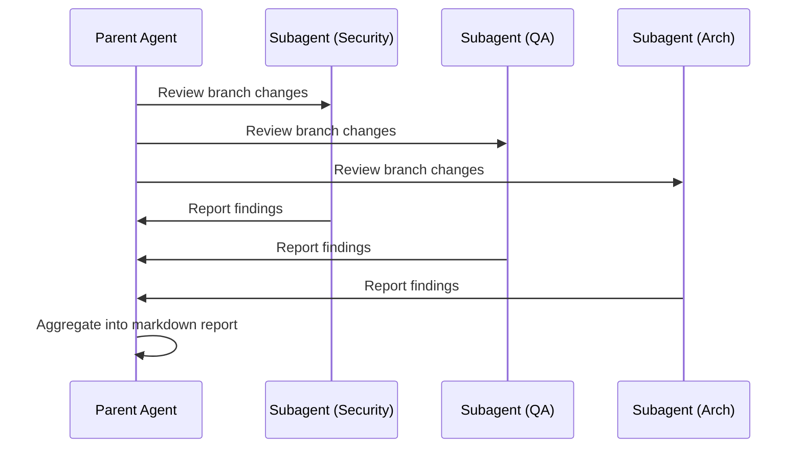

# Subagent Dispatch Contract

This contract defines the core coordination patterns for how AI coding agents (such as Claude Code or Antigravity) dispatch background subagents or sub-tasks autonomously during a development phase.

Adapters that declare `subagents: true` in their capabilities must implement these dispatch interfaces to keep the core workflow tool-agnostic.

---

## 1. Persona and Role Declarations

When spawning a subagent, the parent agent must declare a specialized **Persona** or **Role** from this list. Do not use generic or ad-hoc personas.

| Role Name | Scope & Focus | Typical Tools Needed |
|-----------|---------------|----------------------|
| `QA Engineer` | Writes test files, designs edge-case inputs, runs validations | `read_file`, `write_file`, `command` |
| `Security Reviewer` | Analyzes code for secrets leakage, unsafe operations, overflow risks | `read_file` |
| `Architecture Guard` | Asserts alignment with SOLID, DIP boundaries, and design specs | `read_file` |
| `Researcher` | Gathers context, reads library documentation, runs web searches | `read_file`, `read_url`, `web_search` |
| `Developer` | Implements logic changes, fixes bugs, formats code | `read_file`, `write_file`, `command` |

---

## 2. Dispatch Patterns

The engine supports two primary coordination patterns for executing subagents:

### Pattern A: Sequential with Feedback

Used for iterative refinement of a single task (such as bug fixing or feature implementation).

*   **Strike/Retry Budget**: The sequential loop is capped at a maximum of **3 strikes** (reframes) before the parent agent must perform a discretionary stop and request user intervention.

### Pattern B: Parallel Fan-Out

Used for comprehensive review, research, or cross-cutting analysis.

*   **Aggregation**: Parent agents must aggregate parallel subagent outputs into a single consolidated, user-visible markdown document (e.g. `/review-code` aggregates security, QA, and architectural reviews).

---

## 3. Error Handling and Aggression

1.  **Failing Fast**: If a subagent encounters a permission error, missing credentials, or external billing failure, it must immediately report this to the parent. The parent must perform a discretionary stop.
2.  **No Leaked Side-Effects**: Subagents must only operate within the target workspace. Any temporary scratch directories must be cleaned up on completion.
3.  **Validation Dominance**: The parent agent's validation commands always override a subagent's claim of completion. A task is only `[x]` complete if the parent-executed verification command exits `0`.

---

## 4. Adapter Integration Guides

### Claude Code (`claude-code`)
*   **Wiring**: Claude Code dispatches subagents using the native `Task` tool.
*   **Context Sizing**: Limit subagent task descriptions to keep prompt overhead low.

### Antigravity (`antigravity`)
*   **Wiring**: Antigravity dispatches subagents using the native `invoke_subagent` and `define_subagent` tools.
*   **Artifact Alignment**: The parent Antigravity agent updates `task.md` and `implementation_plan.md` in the parent context when subagents report success.
