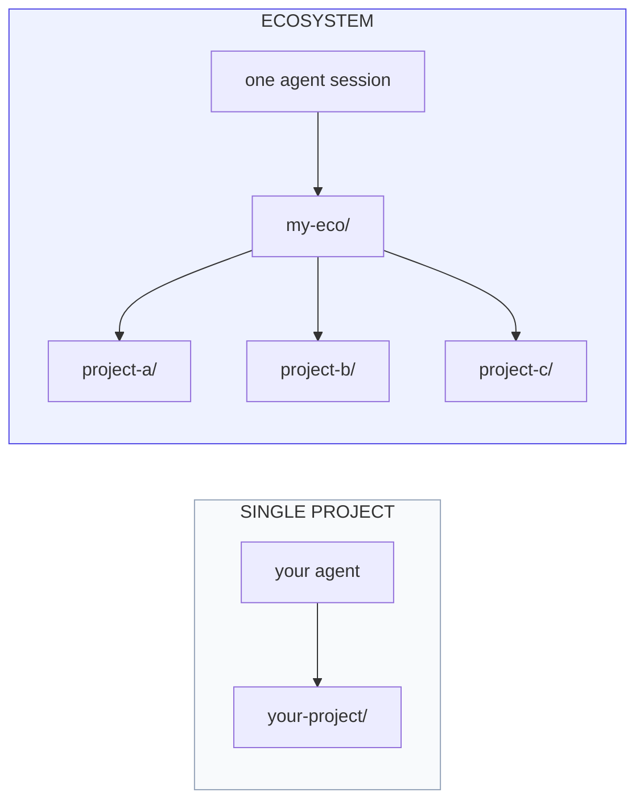

<div align="center">
  

  ### Spec-driven discipline for agentic AI

  Phases. Decisions. History. Backlog. First-class state across any AI IDE.

  [](https://www.npmjs.com/package/@avinash-singh-io/momentum)
  [](LICENSE)
  [](https://trymomentum.github.io/)
</div>

---

## What is momentum?

momentum is the **state layer for agentic AI**.

Agentic AI raised the floor on individual productivity — anyone can spawn an agent to write code, manage infrastructure, run research, or operate a data pipeline now. **What didn't scale was coherent project state**: phases that drift, decisions that vanish into chat transcripts, backlogs that exist only in someone's head.

momentum makes that state durable. Specs, decisions, history, backlog — all as first-class files your agent reads and writes automatically. The project itself becomes durable, not just whatever the agent shipped this session.

## Quick install

```bash
npx @avinash-singh-io/momentum@latest init
```

That's it. The agent picks up the workflow on next session start.

> Always pin `@latest`. A bare `npx @avinash-singh-io/momentum` can serve a
> stale, cached version; `@latest` forces npx to resolve the newest release.

```bash
# Want a specific adapter?
npx @avinash-singh-io/momentum@latest init --agent codex        # Codex
npx @avinash-singh-io/momentum@latest init --agent antigravity  # Antigravity

# Coordinating multiple related projects?
npx @avinash-singh-io/momentum@latest init --ecosystem my-eco
```

## Works with any AI IDE

| Agent | Status | Primary instruction file |
| --- | --- | --- |
| [Claude Code](https://trymomentum.github.io/ide-support/#claude-code) | ✅ Shipped | `CLAUDE.md` |
| [Codex](https://trymomentum.github.io/ide-support/#codex) | ✅ Shipped | `AGENTS.md` |
| [Antigravity](https://trymomentum.github.io/ide-support/#antigravity) | ✅ Shipped | `AGENTS.md` |
| [Cursor](https://trymomentum.github.io/ide-support/#cursor) | 🛠️ Planned (Phase 15) | `.cursor/rules/` |
| [Gemini CLI](https://trymomentum.github.io/ide-support/#gemini-cli) | 🛠️ Planned (Phase 15) | `GEMINI.md` |

Same commands, same workflow, every agent. Switch adapters anytime; the per-project state survives.

## Keeping projects up to date

Upgrading is **two steps** — update the CLI, then re-sync each project's files:

```bash
npm install -g @avinash-singh-io/momentum@latest   # 1. update the CLI
momentum upgrade                                    # 2. re-sync this project
```

`momentum upgrade` copies files from the *installed* CLI (not from npm), so your
project files are only ever as new as the CLI — skip step 1 and step 2 just
re-installs the same old files. Upgrade is safe by design: your `## Project
Extensions` block is preserved, changed files are backed up to `.bak`, files a
newer version drops are removed (also `.bak`-backed), and your own files are
never touched. Preview anything with `momentum upgrade --dry-run`.

Running an **ecosystem**? Sweep every member in one pass:

```bash
momentum ecosystem upgrade            # skips dirty repos; reports each version
momentum ecosystem upgrade --dry-run  # preview the whole fleet, write nothing
```

A momentum-managed project records its version-of-record in
`.momentum/installed.json` (committed) — that's what powers orphan cleanup and
the ecosystem sweep's per-repo version report.

## What you get

| | |
| --- | --- |
| 🧭 **Phases** | Plan → execute → verify → release. Every phase has a brainstorm, plan, tasks, history. |
| 📋 **Backlog** | Bugs / features / tech debt / enhancements with priorities and per-item context. |
| 📜 **History** | Append-only log of decisions, discoveries, scope changes. The *why* outlives any session. |
| ⚖️ **Rules** | 13 autonomous agent rules — orient first, verify before claim, log every decision. |
| 🛠️ **Skills** | ~15 slash commands your agent runs — start, complete, sync, review, validate. |
| 🌐 **Multi-project** | Ecosystem mode (state layer) + Orchestration primitives (action layer) for cross-project work. |

## Single project ↔ Multi-project ecosystem

Single-project usage is the default. When you have related projects that need to coordinate, ecosystem mode lets one agent session work across all of them.



**Hard invariant**: a project running `momentum init` without `--ecosystem` sees zero difference from before ecosystem mode existed. Ecosystem mode is purely additive.

[Read the ecosystem deep dive →](https://trymomentum.github.io/ecosystem/)

## Orchestration primitives

Four verbs the agent composes per task — not a pipeline. They're how the agent **acts** across projects (ecosystem mode is the durable **state** they read and write).

- **`scout`** — Read-only context fetch from a project without opening a session there.
- **`dispatch`** — Parallel fan-out across N projects with auto-tailored prompts + synthesis.
- **`handoff`** — Cross-session control transfer with a structured context block.
- **`continue`** — Pick up a pending handoff. Idempotent.

[Read the orchestration deep dive →](https://trymomentum.github.io/orchestration/)

## The 13 autonomous rules

Discipline preserved without enforcement overhead. Three of the highest-leverage:

- **Rule 6 — Git lifecycle.** Feature branch auto-created. Conventional commits. Push silently. NEVER merge to main without explicit OK.
- **Rule 8 — Record phase history.** Every meaningful decision lands in `history.md` at the moment it happens. The *why* outlives every session.
- **Rule 12 — Verify before claim.** No completion without evidence. Run the test, read the output, mark done only if the output shows pass.

[Read all 13 rules with full text + red flags →](https://trymomentum.github.io/rules/)

## Why momentum exists

The thesis is narrow: **state that outlives any single session**.

What's new about agentic AI is that the agent acts. What's old is that acts without context disappear into noise. Spec-driven discipline gives the agent context that outlives any single session — `status.md` at session start, `history.md` for every decision, `backlog.md` for everything queued. The agent verifies before claiming done. The agent doesn't pollute curated docs with orchestration noise.

The discipline is the differentiator. The toolkit is the implementation.

[Read the philosophy + design principles →](https://trymomentum.github.io/about/)

## Docs

- 🌐 **Live site** — [trymomentum.github.io](https://trymomentum.github.io/)
- 📚 **Getting started** — [trymomentum.github.io/getting-started/](https://trymomentum.github.io/getting-started/)
- 💡 **Concepts** — [trymomentum.github.io/concepts/](https://trymomentum.github.io/concepts/)
- 🛠️ **Skills** — [trymomentum.github.io/skills/](https://trymomentum.github.io/skills/)
- ⚖️ **Rules** — [trymomentum.github.io/rules/](https://trymomentum.github.io/rules/)
- 🌐 **Multi-project** — [Ecosystem mode](https://trymomentum.github.io/ecosystem/) · [Orchestration](https://trymomentum.github.io/orchestration/)
- ❓ **FAQ** — [trymomentum.github.io/faq/](https://trymomentum.github.io/faq/)

## Contributing

Issues + discussions + PRs welcome at [github.com/avinash-singh-io/momentum](https://github.com/avinash-singh-io/momentum). The project itself uses momentum, so contributing means following the same workflow — phases, history entries, conventional commits, `/complete-phase` before release.

## License

[MIT](LICENSE)
