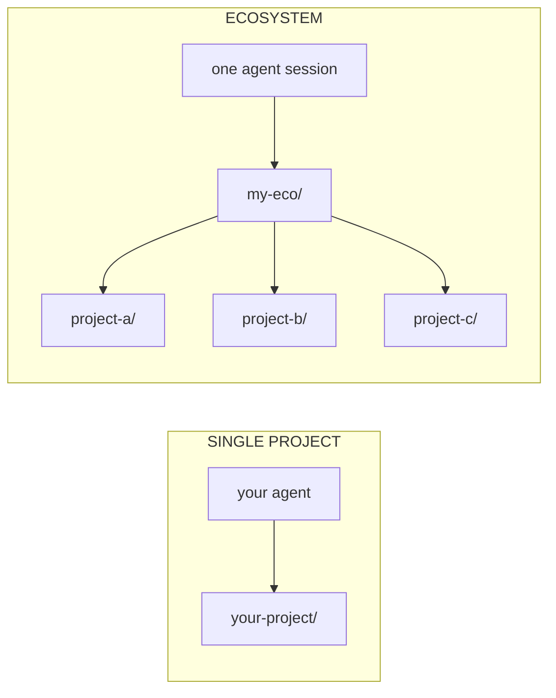

<div align="center">
  <picture>
    <source media="(prefers-color-scheme: dark)" srcset="https://raw.githubusercontent.com/LiminaLabsAI/momentum/main/site/public/brand/momentum-lockup-dark.svg">
    
  </picture>

  ### The right context for your coding agent

  momentum keeps your project's memory and state as Markdown files in the repo —
  so every session your agent retrieves the right context, hallucinates less,
  and turns a vague request into a well-grounded plan.

  [](https://www.npmjs.com/package/@limina-labs/momentum)
  [](LICENSE)
  [](https://trymomentum.github.io/)

  <sub>Built and maintained by <a href="https://github.com/LiminaLabsAI">Limina Labs</a></sub>
</div>

---

## Your agent doesn't need more context. It needs the right context.

**Without it, your agent guesses.** Ask an agent to fix a bug and it greps
around, fills the gaps with assumptions, and drafts a plan on shaky ground —
burning tokens rediscovering what your project already knew. And whatever it
does learn evaporates at the context limit or the next fresh session.

momentum hands the agent your project's real state up front. Phases, decisions,
history, and backlog live as plain Markdown files in the repo — read at the
start of every session, updated as the agent works — so it reasons from
recorded facts instead of guesses, and the *project* persists, not just
whatever one session shipped.

| Without momentum | With momentum |
| --- | --- |
| Greps the codebase, hopes it found the right files | Reads project state first — oriented in seconds |
| Fills the gaps with assumptions — hallucinates | Reasons from recorded decisions, not guesses |
| Plans on shaky ground, burns tokens rediscovering | Produces a well-grounded, actionable plan |

## Quick install

```bash
npx @limina-labs/momentum@latest init
```

momentum asks which coding agent to scaffold for — there is no default. Pass
`--agent` to answer up front (required in non-interactive shells). That's it.
The agent picks up the workflow on next session start.

> Always pin `@latest`. A bare `npx @limina-labs/momentum` can serve a
> stale, cached version; `@latest` forces npx to resolve the newest release.

```bash
# Or pick the adapter up front:
npx @limina-labs/momentum@latest init --agent claude-code  # Claude Code
npx @limina-labs/momentum@latest init --agent opencode     # opencode
npx @limina-labs/momentum@latest init --agent codex        # Codex
npx @limina-labs/momentum@latest init --agent antigravity  # Antigravity

# Coordinating multiple related projects?
npx @limina-labs/momentum@latest init --ecosystem my-eco
```

## Better context in. Better work out.

- **Less hallucination** — the agent reasons from recorded facts (status,
  decisions, history) instead of confident guesses. Fewer wrong turns, fewer
  retries.
- **Higher-signal context** — the relevant history and prior decisions surface
  first, not whatever a blind search returned. Less noise in the window, less
  token waste.
- **Better-grounded plans** — a vague ask becomes a concrete plan: what to
  change, where in the codebase, and how to verify it.

Based on hands-on use — momentum reduces guesswork and re-derivation. Your
mileage will vary by project and agent.

## The phase loop

Work happens in **phases** — one repeatable unit of work, five stages:

**Brainstorm → Plan → Execute → Verify → Release**

New projects begin with a one-time **founding** step: `/brainstorm-idea`
explores the idea (writes nothing), then `/start-project` authors the
charter, principles, success criteria, and roadmap from that brainstorm —
momentum never ships placeholder docs, and phase commands wait until the
project is founded.

Your agent drives all of it: scopes through dialogue (disk writes gated until
you approve), plans groups + tasks + acceptance criteria, commits per group
with conventional commits, and marks tasks done only with passing evidence.
It stops at exactly one hard gate — the merge and release are yours to approve.

## How it works — no daemon, no lock-in

momentum isn't a framework or a background service. It's plain files and conventions your agent already knows how to read:

1. **`init` writes files into your repo** — your agent's instruction file (`CLAUDE.md` / `AGENTS.md`), a `specs/` folder, rule and slash-command definitions, and git hooks.
2. **Your AI IDE already reads that instruction file every session** — momentum just fills it with a structured workflow and a map of where project state lives.
3. **Your agent maintains the state as it works** — it reads `status.md` to orient, logs decisions to `history.md`, and tracks work in `backlog.md`. Automatically.

Nothing runs in the background. No service to manage, no lock-in: **uninstall = delete the files.**

## Works with any AI IDE

| Agent | Status | Primary instruction file |
| --- | --- | --- |
| [opencode](https://opencode.ai) | ✅ Shipped (v0.28.0, live-validated) | `AGENTS.md` |
| [Claude Code](https://trymomentum.github.io/ide-support/#claude-code) | ✅ Shipped | `CLAUDE.md` |
| [Codex](https://trymomentum.github.io/ide-support/#codex) | ✅ Shipped | `AGENTS.md` |
| [Antigravity](https://trymomentum.github.io/ide-support/#antigravity) | ✅ Shipped | `AGENTS.md` |
| [Cursor](https://trymomentum.github.io/ide-support/#cursor) | 🛠️ Planned (Phase 15) | `.cursor/rules/` |
| [Gemini CLI](https://trymomentum.github.io/ide-support/#gemini-cli) | 🛠️ Planned (Phase 15) | `GEMINI.md` |

Same commands, same workflow, every agent. Switch adapters anytime; the per-project state survives.

## Keeping projects up to date

Upgrading is **two steps** — update the CLI, then re-sync each project's files:

```bash
npm install -g @limina-labs/momentum@latest   # 1. update the CLI
momentum upgrade                                    # 2. re-sync this project
```

`momentum upgrade` copies files from the *installed* CLI (not from npm), so your
project files are only ever as new as the CLI — skip step 1 and step 2 just
re-installs the same old files. Upgrade is safe by design: your `## Project
Extensions` block is preserved, changed files are backed up to `.bak`, files a
newer version drops are removed (also `.bak`-backed), and your own files are
never touched. Preview anything with `momentum upgrade --dry-run`.

Running an **ecosystem**? Sweep every member in one pass:

```bash
momentum ecosystem upgrade              # skips dirty repos; reports each version
momentum ecosystem upgrade --dry-run    # preview the whole fleet, write nothing
momentum ecosystem upgrade --autostash  # stash dirty repos, upgrade, restore them
```

`--autostash` lets a repo with uncommitted work upgrade anyway: it stashes the
in-flight changes, runs the upgrade on a clean tree, then restores your work
exactly as it was — so you don't have to commit or stash by hand first. If the
upgrade ever touches a file you'd also changed, your work is kept safe in
`git stash` rather than overwritten. (`--force` is the blunt alternative:
upgrade in place without stashing.) Same flags work on single-repo
`momentum upgrade`.

A momentum-managed project records its version-of-record in
`.momentum/installed.json` (committed) — that's what powers orphan cleanup and
the ecosystem sweep's per-repo version report.

## Your specs are an open knowledge bundle

Every momentum project's `specs/` tree is a conformant **[Open Knowledge
Format](https://github.com/GoogleCloudPlatform/knowledge-catalog/blob/main/okf/SPEC.md)
(OKF v0.1)** bundle — Google Cloud's open, vendor-neutral standard for agent
knowledge: markdown concept files with YAML frontmatter, reserved `index.md`
listings for progressive disclosure, ordinary markdown links as the
relationship graph. Any OKF consumer — a knowledge catalog, a visualizer,
someone else's agent — can read your specs with zero momentum knowledge, and
there is no JSON state left to drift: a phase's status lives in the phase's
own `overview.md` frontmatter.

```bash
momentum okf check    # conformance report for specs/ (exit 1 on violations)
momentum okf index    # regenerate the bundle listings
```

Existing projects convert automatically on `momentum upgrade`: legacy
`specs/phases/index.json` is distributed into per-phase frontmatter,
`impact-map.json` becomes a readable table, every spec file gains its `type`,
and the old JSON is removed. The migration preserves your prose byte-for-byte
and is idempotent. (ADR-0005.)

## What you get

| | |
| --- | --- |
| 🧭 **Phases** | Plan → execute → verify → release. Every phase has a brainstorm, plan, tasks, history. |
| 📋 **Backlog** | Bugs / features / tech debt / enhancements with priorities and per-item context. |
| 📜 **History** | Append-only log of decisions, discoveries, scope changes. The *why* outlives any session. |
| ⚙️ **Config** | `specs/config.md` — forge, publish target, branch flow, test/build commands. Recipes adapt to your project, not npm+GitHub defaults. |
| ⚖️ **Rules** | 13 autonomous agent rules — orient first, verify before claim, log every decision. |
| 🛠️ **Skills** | ~15 slash commands your agent runs — start, complete, sync, review, validate. |
| 🌐 **Multi-project** | Ecosystem mode (state layer) + Orchestration primitives (action layer) for cross-project work. |

## Single project ↔ Multi-project ecosystem

Single-project usage is the default. When you have related projects that need to coordinate, ecosystem mode lets one agent session work across all of them.



**Hard invariant**: a project running `momentum init` without `--ecosystem` sees zero difference from before ecosystem mode existed. Ecosystem mode is purely additive.

[Read the ecosystem deep dive →](https://trymomentum.github.io/ecosystem/)

## Orchestration primitives

Four verbs the agent composes per task — not a pipeline. They're how the agent **acts** across projects (ecosystem mode is the durable **state** they read and write).

- **`scout`** — Read-only context fetch from a project without opening a session there.
- **`dispatch`** — Parallel fan-out across N projects with auto-tailored prompts + synthesis.
- **`handoff`** — Cross-session control transfer with a structured context block.
- **`continue`** — Pick up a pending handoff. Idempotent.

[Read the orchestration deep dive →](https://trymomentum.github.io/orchestration/)

## Parallel workstreams

One repo, several features in flight, each in its own agent session — momentum models each as a **lane**: a branch (usually in its own worktree) bound to one phase, with its own session. Each session resolves its phase from its branch, writes only its own lane's tracking, and finished lanes land on `main` **one at a time** with the suite green between landings. `momentum lanes` is the mechanism: open lanes (worktree created for you), see the ambient board with queue pressure from any session, signal other lanes, and land through a merge queue with graded evidence gates. Isolation substrate is yours to pick — plain `git worktree` works out of the box; treehouse pools or GitButler virtual branches light up extra speed. momentum recommends, never requires.

[Read the parallel workstreams guide →](https://trymomentum.github.io/parallel-work/)

## Team mode — N humans, N clones, N repos

Lanes coordinate N sessions on one disk. **Team mode** extends the same story to
**N humans on N clones sharing one git remote** — no server, no daemon, offline-first.
It rests on two git-native primitives: **per-actor coordination fragments**
(`.momentum/team/`, committed and conflict-free by own-prefix construction) and
**`refs/momentum/*` compare-and-swap** for atomic allocations. `momentum claim` reserves
a phase/version/backlog-id before you act; `momentum team` gives you a shared board,
presence, landing turns, reviewer≠author approvals, and cross-machine leases. The
whole plane runs at the **ecosystem** layer too: remote-URL members (teammates need no
shared folder layout), a shared attributed active initiative, and cross-machine-safe
swarm ownership. The layout is a published contract any dashboard can read.

```bash
bash scripts/demo-team.sh   # two clones + two repos, all local, ~10s, self-cleaning
```

[Read the team mode guide →](https://trymomentum.github.io/team/)

## The 13 autonomous rules

Discipline preserved without enforcement overhead. Three of the highest-leverage:

- **Rule 6 — Git lifecycle.** Feature branch auto-created. Conventional commits. Push silently. NEVER merge to main without explicit OK.
- **Rule 8 — Record phase history.** Every meaningful decision lands in `history.md` at the moment it happens. The *why* outlives every session.
- **Rule 12 — Verify before claim.** No completion without evidence. Run the test, read the output, mark done only if the output shows pass.

[Read all 13 rules with full text + red flags →](https://trymomentum.github.io/rules/)

## Why momentum exists

The thesis is narrow: **state that outlives any single session**.

What's new about agentic AI is that the agent acts. What's old is that acts without context disappear into noise. Spec-driven discipline gives the agent context that outlives any single session — `status.md` at session start, `history.md` for every decision, `backlog.md` for everything queued. The agent verifies before claiming done. The agent doesn't pollute curated docs with orchestration noise.

The discipline is the differentiator. The toolkit is the implementation.

[Read the philosophy + design principles →](https://trymomentum.github.io/about/)

## Docs

- 🌐 **Live site** — [trymomentum.github.io](https://trymomentum.github.io/)
- 📚 **Getting started** — [trymomentum.github.io/getting-started/](https://trymomentum.github.io/getting-started/)
- 💡 **Concepts** — [trymomentum.github.io/concepts/](https://trymomentum.github.io/concepts/)
- 🛠️ **Skills** — [trymomentum.github.io/skills/](https://trymomentum.github.io/skills/)
- ⚖️ **Rules** — [trymomentum.github.io/rules/](https://trymomentum.github.io/rules/)
- 🌐 **Multi-project** — [Ecosystem mode](https://trymomentum.github.io/ecosystem/) · [Orchestration](https://trymomentum.github.io/orchestration/)
- ❓ **FAQ** — [trymomentum.github.io/faq/](https://trymomentum.github.io/faq/)

## Contributing

Issues + discussions + PRs welcome at [github.com/LiminaLabsAI/momentum](https://github.com/LiminaLabsAI/momentum). The project itself uses momentum, so contributing means following the same workflow — phases, history entries, conventional commits, `/complete-phase` before release.

## License

[MIT](LICENSE)
