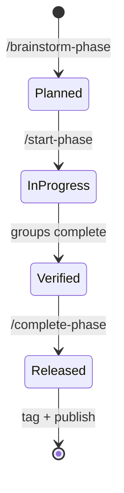

momentum is a small set of primitives organized into a workflow. Once you
understand the five concepts on this page, the rest of the toolkit is just
glue.

The primitives are deliberately separate:

- **Phases** are the unit of work — bounded, planned, shipped.
- **Backlog** is the durable home for everything that doesn't fit the
  current phase.
- **History** is the append-only record of *why* decisions were made.
- **ADRs** are the deeper context for structural decisions.
- **Ecosystem mode** is the optional layer for cross-project coordination.

Each is a file (or a small set of files) on disk. The agent reads and writes
them as part of the standard workflow. Humans read them too — that's the
point.

## Phases

A **phase** is a unit of work — a focused sprint to ship one coherent piece
of value. Every phase has four files in its own directory:

```
specs/phases/phase-N-shortname/
├── overview.md      # goal, scope, deliverables, acceptance criteria
├── plan.md          # implementation approach (Group Execution Pattern)
├── tasks.md         # granular checklist [ ] / [x] / [/]
└── history.md       # append-only log of decisions and discoveries
```

A phase lifecycle is: `/brainstorm-phase` → `/start-phase` → ship → `/sync-docs` → `/complete-phase`.



### Why phases?

Agentic AI work without phases turns into a sprawl. The agent picks up
loose threads, drops them halfway, picks up new ones. Six weeks in, you
can't tell what's shipped, what's half-done, what got abandoned.

Phases close the loop. Every piece of work has a **plan** before it starts,
**verification** before it claims done, a **history** explaining the why, and
a **tag** marking it released. The phase boundary is also the **git
discipline boundary** — branches, PRs, version bumps all align to phase
completion.

### The Group Execution Pattern

`plan.md` declares groups of related work. A typical layout:

```
# Mixed: Group 0 → (Groups 1 + 2 in parallel) → Group 3 → Group 4
```

- **Group 0** — contracts, types, schemas. Sequential. Blocks everything.
- **Middle groups** — independent feature areas. Parallel candidates.
- **Penultimate** — wiring + integration. Sequential.
- **Last** — verification. Sequential.

`/start-phase` reads the execution order and runs the plan
**autonomously** — committing per group, pushing after each, only stopping
at the merge + release gate. You stay in the loop without being a
bottleneck.

### Phase boundaries are git boundaries

- Branch: `phase-N-shortname` (created by `/start-phase`)
- Commits: conventional style with per-group commit messages
- PR: phase branch → main, opened at completion
- Tag: `vX.Y.Z` on main once merged
- npm publish (for npm packages): part of `/complete-phase`

You never commit directly to main during phase work. Rule 6 enforces the
boundary.

## Backlog

The **backlog** at `specs/backlog/backlog.md` is a single markdown file with
four sections: Bugs, Features, Tech Debt, Enhancements. Each item has an ID,
priority, status, target phase (or "unscheduled"), and a per-item context
block.

```
| BUG-001 | install.sh blank-line bug | P3 | resolved | phase-1 | Fixed via mkdir -p before realpath. |
```

### Priorities

| Level | Meaning | SLA |
|---|---|---|
| `P0` | Critical — blocks current phase | < 1 day |
| `P1` | High — current or next phase | < 1 week |
| `P2` | Medium — within 2 phases | < 1 phase |
| `P3` | Low — nice to have | best-effort |

The SLAs are calibration, not contract — they help the agent decide what to
surface during pre-phase bug checks (Rule 4).

### ID prefixes

| Prefix | Meaning |
|---|---|
| `BUG-` | Defect |
| `FEAT-` | New capability |
| `TD-` | Tech debt — refactor, cleanup |
| `ENH-` | Enhancement — improvement to an existing feature |

IDs are monotonic within each prefix. They never get reused.

### How items move

The backlog isn't a parking lot — items move into phases as work begins. The
`Phase` column captures which phase an item landed in. The `Status` column
tracks: `open` → `in-progress` → `resolved` (or `deferred` / `deprecated`).
A resolved item stays in the backlog as searchable history; the agent doesn't
delete history.

The agent (per Rule 3) **auto-tracks discoveries**: any bug, tech debt, or
enhancement noticed during work lands in the backlog immediately, with the
user notified.

## Config

`specs/config.md` is the project-shape settings file recipe templates
read at execution time (ADR-0009). It tells momentum **what kind of project
this is** so gates and release steps adapt instead of assuming npm + GitHub +
a `staging → main` flow:

| Field | Example | What it drives |
|---|---|---|
| `language` / `framework` | `node` / `nextjs` | verification defaults |
| `test_command` / `build_command` | `npm test` / `npm run build` | `/complete-phase` step 3, `/brainstorm-phase` defaults |
| `publish_target` / `release_flow` | `npm` / `tag-and-publish` | release gate phrasing |
| `git_forge` / `release_command` | `github` / `gh release create` | which forge release command (if any) |
| `end_state` | `merge-after-yes` | how far the agent goes before handing back |
| `branch_flow` / `protected_branches` | `staging, main` | the merge sequence + which branches the pre-push hook guards |

`momentum init` infers these from your manifests + git remote; `/start-project`
confirms them at founding; edit the file anytime. When the project shape
changes (you switched forge, adopted a framework), `momentum config sync`
re-infers, shows the drift, and applies your approved changes — nothing is
ever written without your OK. The **trust layer** — human authorization for a
protected-branch push — is invariant and never a preference; the only bypass
is the auditable `MOMENTUM_SKIP_HOOKS=1`.

## History

Every phase has a `history.md` — an **append-only log** with structured
entries. The log is the only place where the *why* of a decision is captured
**at the moment it was made**.

```
### [DECISION] 2026-06-08 — Short title of the call
Topics: phase-13, area, area
Affects-phases: phase-13-site-polish
Affects-specs: path/to/file.md
Detail: One to three sentences describing what was decided and why.

---
```

### Entry types

| Type | When to use |
|---|---|
| `[DECISION]` | A call was made — technology choice, design direction, ADR created |
| `[SCOPE_CHANGE]` | Phase deliverables added or removed |
| `[DISCOVERY]` | Bug, tech debt, or enhancement found |
| `[FEATURE]` | New planned feature within the phase |
| `[ARCH_CHANGE]` | Architectural pattern shifted |
| `[EVALUATOR]` | Locked evaluator defined or evaluation set changed |
| `[NOTE]` | Anything else worth a future reader's time |

### Why append-only?

Specs document the **current state**. Commit messages document the
**mechanical change**. Only history captures **motivation** — the
constraint that made you pick path A over path B, the discovery that
narrowed the design space, the scope cut that kept the phase shippable.

Six months later, someone asks "why did we pick X here?" The commit just
says `feat: pick X`. The spec says `we use X`. The history says
`we picked X because Y didn't satisfy constraint Z; we explored W but the
testing cost outweighed the marginal gain.`

That's the constraint that's load-bearing, not the chosen path.

### A worked entry

```
### [DECISION] 2026-06-07 — Astro Starlight as the site framework
Topics: phase-12, tech-stack, astro, starlight
Affects-phases: phase-12-public-site
Affects-specs: specs/phases/phase-12-public-site/overview.md
Detail: Markdown-first, zero-JS by default, beautiful docs theme + freedom
for a custom landing page. Rejected alternatives: Docusaurus (heavier),
VitePress (less landing flexibility), Nextra (Next.js overhead). Best fit
for "landing + docs + easy UX" on a tight v1 timeline.
```

That entry is the difference between "we use Starlight" (which the spec says)
and "we picked Starlight because the three alternatives didn't fit the
constraints" (which only history records).

### Doc sync at phase completion

During a phase, the agent only writes to `history.md` (Rule 9). At
completion, `/sync-docs` reads the history, identifies which other specs
need updating (via topics + Affects-specs), and applies the updates in one
batch. The agent doesn't update specs mid-phase — that would let the
reference move while everyone's depending on it (Rule 10).

## ADRs

When a decision is **structural** or **contested** enough to deserve its own
document, momentum uses **Architecture Decision Records** at
`specs/decisions/NNNN-title.md`. Each ADR captures:

- **Context** — what problem are we solving, what constraints apply
- **Decision** — the specific choice
- **Alternatives** — what else we considered, with rejection rationale
- **Consequences** — what becomes harder or easier after this choice

ADRs supersede history entries when the decision becomes a **reference point**
future phases need to consult — e.g., "we use the DIP pattern across all
adapters" is an ADR because new adapters need to follow it.

Format borrowed from Michael Nygard's original ADR template; nothing exotic.

### When to write an ADR vs a history entry

| Write an ADR when… | Write a history entry when… |
|---|---|
| The decision spans multiple phases | The decision is phase-local |
| The decision changes architecture | The decision is operational |
| Future readers will need to consult this directly | Future readers can find this via topic search |
| The "why" is genuinely contested | The "why" is clear-but-worth-recording |

When in doubt: write the history entry first. If it gets referenced from a
later phase's history, promote it to an ADR then.

## Ecosystem mode

The optional layer for cross-project coordination. When you have multiple
related projects, ecosystem mode adds:

- A shared **ecosystem manifest** (`ecosystem.json`)
- **Initiatives** — features that span multiple projects
- A **daily session log** — auto-appended on commits / PRs across members
- Hard invariant: single-project usage is unchanged.

### How they relate — ecosystem mode + orchestration

These two are a **pair**, not alternatives:

- **Ecosystem mode = STATE layer.** The durable record: manifest,
  initiatives, sessions, pointer blocks. Nouns. What the agent reads
  and writes.
- **Orchestration = ACTION layer.** Four verbs the agent composes:
  `scout` / `dispatch` / `handoff` / `continue`. What the agent
  *does* across projects.

Orchestration verbs read and write ecosystem state. Ecosystem state
gives orchestration something durable to point at. Either alone is
half the pattern — ecosystem without orchestration is bookkeeping;
orchestration without ecosystem is action with no record.

**Deep dives:** [Ecosystem mode](/ecosystem/) · [Orchestration](/orchestration/)

## How they fit together

Picture a single-project workflow:

1. Something needs doing → land it in the **backlog** with a priority.
2. When it's time to ship it, pull it (and related items) into a **phase**.
3. Run the phase. Every meaningful decision, discovery, or scope change
   lands in **history** at the moment it happens.
4. Structural decisions get an **ADR** — promoted from history when they
   become future-readable references.
5. At completion, **doc sync** propagates history into the other specs;
   `/complete-phase` runs verification, tags the release, and publishes.

For multi-project workflows, **ecosystem mode** adds a coordination layer on
top — initiatives + session log + orchestration primitives. Each member
still runs the per-project loop unchanged.

The point of every primitive is the same: **state that outlives any single
session**, surfaced where the agent and the humans both look.
