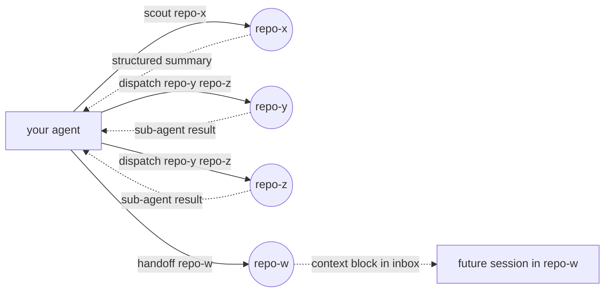
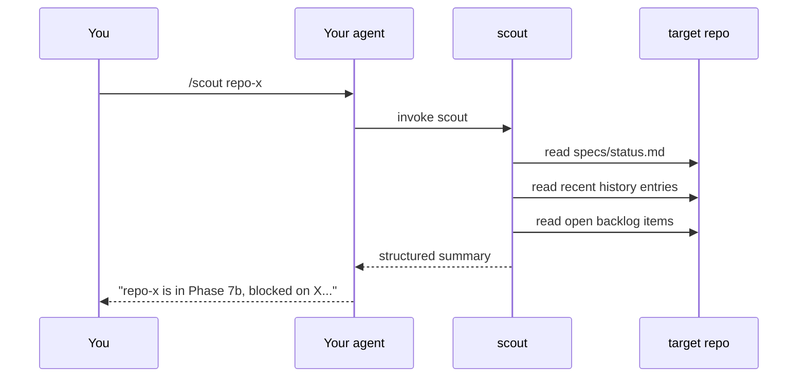
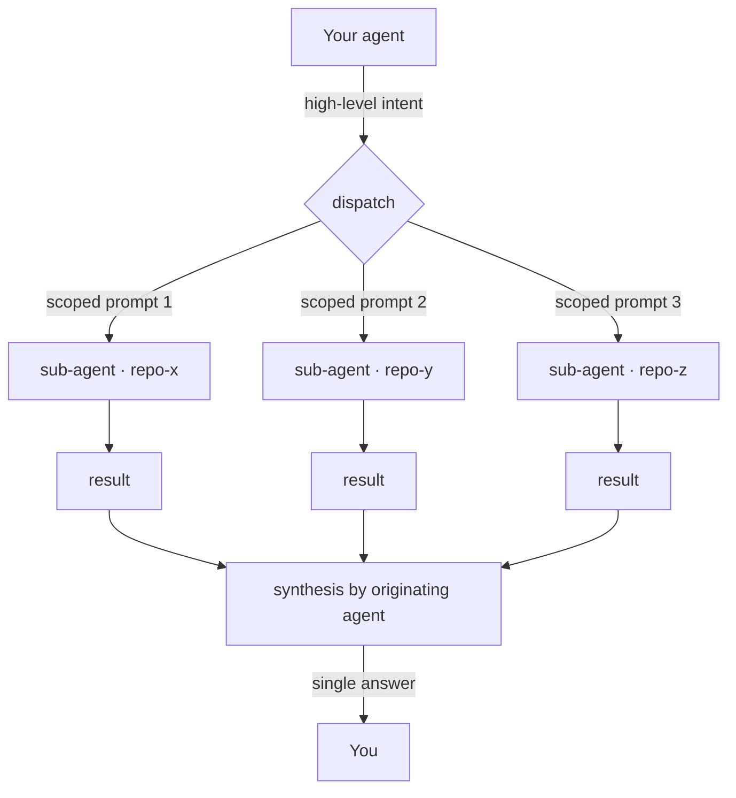
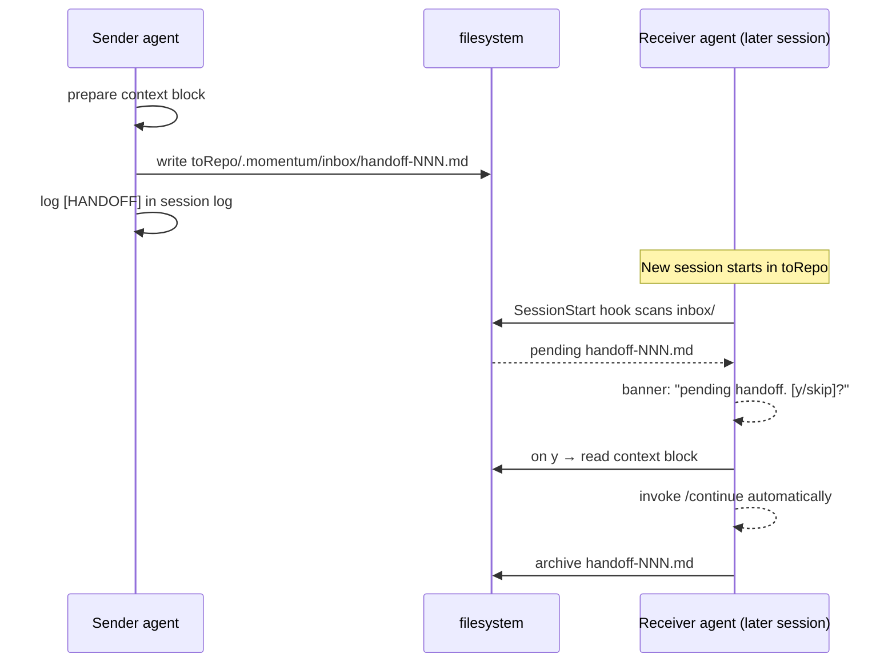

> **Orchestration** is momentum's umbrella for multi-project work. Three layers: **[Ecosystem](/ecosystem/)** (shared state), **Cross-project actions** (one-shot moves — this page), **[Swarm](/swarm/)** (sustained delivery). Both action tiers read and write the same ecosystem foundation.

Cross-project actions are the **one-shot layer** of orchestration. Four verbs the agent composes per task — `scout`, `dispatch`, `handoff`, `continue`. They read and write the durable state that **[Ecosystem](/ecosystem/)** provides; together they form the canonical *single-move* multi-project pattern (each pointless without the other — actions with no record turn into vapor; records with no actions are just bookkeeping).

When you work across multiple related projects, you don't want N parallel agent sessions losing track of each other. You want **one agent session that can reach into other projects when it needs to** — read state without opening a session there, fan out work in parallel, hand off control with full context. The four primitives are the verbs; your agent picks the sentence. Some tasks need just a single `scout`. Others need a parallel `dispatch` across five projects. Some end in a `handoff` to another machine or session for the implementation.

momentum ships these as **primitives the main agent composes per task — not a pipeline.**

## `dispatch` defers to your intent

`dispatch` is the one verb that reads OR writes depending on what you ask. Earlier versions locked dispatch sub-agents to read-only by a hardcoded system prompt; the verb said "send the agent to do work" but the implementation refused to do anything but look. Industry conventions (GitHub Actions `workflow_dispatch`, PowerShell's `Send`-verb convention) treat dispatch as a write-capable invocation verb, and momentum now aligns with that.

The contract:

- Ask `dispatch` to **audit / investigate / report** → sub-agents stay read-only and return structured findings.
- Ask `dispatch` to **fix / refactor / migrate / bump** → sub-agents write code on a feature branch per Rule 6 (Git Lifecycle) and surface the branch name in their result so the originating session can review.
- Pass `--read-only` (CLI) or the read-only flag (slash form) to force the safety lock regardless of intent.



## Three invocation doors, one shared library

Every primitive ships **three invocation doors** — slash command, natural-language
inference, and CLI — over **one shared `core/orchestration/` library**. The
output shape is identical no matter how you reach for it. That matters because:

- **Slash commands** are the most discoverable surface. `/scout repo-x` works
  in any IDE that supports slash commands (Claude Code, Codex).
- **Natural-language inference** is the most fluid. "Can you check what's
  happening in repo-x?" is enough — the agent infers `scout`, picks the right
  flags, and runs.
- **CLI** is the universal floor. `momentum scout repo-x` works in every
  shipped adapter, including ones without slash support (Antigravity today).

Behavior, output shape, and side effects are identical across all three.
There's nothing the slash command does that the CLI can't, and nothing NL
inference does that you can't replicate explicitly.

---

## `scout` — read-only context fetch {#scout}

When you need to know what's happening in another repo **without opening a
session there**.

`scout` reads the target repo's `specs/status.md`, recent `history.md`
entries, open backlog items, and (if present) any open phase metadata. It
returns a **structured summary**: active phase, recent decisions, P0/P1
backlog items, last release. The originating agent gets enough context to
answer questions about the target without re-reading every file.



### Invocation

- **Slash**: `/scout repo-x`
- **NL inference**: "Can you check what's happening in repo-x?" or "Scout
  repo-x for me."
- **CLI**: `momentum scout repo-x`

### Result shape

Scout returns a `ScoutResult`:

```
{
  repo: "repo-x",
  active_phase: "phase-7b-agent-runtime-compat",
  active_phase_status: "in-progress",
  last_release: "v0.9.0",
  recent_decisions: [{ date, title, topics }, ...],
  open_p0_p1_backlog: [{ id, title, priority }, ...],
  health: "on-track" | "at-risk" | "blocked"
}
```

### When to reach for `scout`

- Before you draft a cross-project PR or initiative — know what the other repo's
  current state is.
- When the user asks "what's going on with repo-x?" and you don't want to
  invent an answer.
- As a precondition for `dispatch` — if you scout first, you can make
  sub-agent prompts more precise.

### When NOT to reach for `scout`

- When you need to **change** anything in the target. Scout is strictly
  read-only. Use `handoff` or `dispatch` for write operations.
- When you need raw file content. Scout summarizes; it doesn't dump source.

---

## `dispatch` — parallel multi-project fan-out {#dispatch}

When the question genuinely spans multiple repos and you need each to answer
**at the same time**, with the originating agent synthesizing the result.

`dispatch` launches one sub-agent per target repo, each with a **scoped
prompt automatically tailored to that repo's context**. Sub-agents run in
parallel (where the adapter declares parallel-subagent capability — Claude
Code, Codex). Each returns a structured result. The originating agent reads
the structured results and synthesizes a single answer.



### Invocation

- **Slash**: `/dispatch repo-x repo-y repo-z`
- **NL inference**: "Across sapience, frontend, and SDK — which one is
  closest to shipping?"
- **CLI**: `momentum dispatch repo-x repo-y repo-z`

### Result shape

Dispatch returns:

```
{
  intent: <user-provided high-level question>,
  per_repo: [
    { repo, scoped_prompt, result, took_ms },
    ...
  ],
  synthesis: <originating-agent answer>,
  failures: [{ repo, error }, ...],
  artifact: ".momentum/runs/dispatch-NNN.md"
}
```

A full trace lands at `.momentum/runs/dispatch-NNN.md` so the run is auditable
later. On the chat surface, the user sees a top-level synthesis answering
their question + collapsible per-repo detail blocks they can expand if they
want the full result.

### Synchronous, not streamed

Sub-agents finish, **then** the originating agent synthesizes. We don't stream
partial results because (a) order would be non-deterministic, making the
output hard to test; (b) on a 7-repo fan-out, streaming gets chaotic; (c) the
synthesis is the answer the user actually asked for — it's worth waiting for.

### Capability-driven routing

If the current adapter doesn't declare `parallelSubagents: true`, dispatch
runs **sequentially** and labels the degraded mode explicitly ("this adapter
does not declare parallel subagents — running sequentially"). The user sees
the slower mode coming; they're not surprised by a 4× longer wait with no
explanation.

### When to reach for `dispatch`

- When the question genuinely depends on N repos' state and synthesis adds
  value over per-repo scouts.
- For multi-project refactors where you need to know which member has the
  pattern and which has the gap.
- When you'd otherwise be tempted to open N parallel agent sessions and
  manually compare notes.

### When NOT to reach for `dispatch`

- When you only need ONE repo's state — use `scout`.
- When the work requires **coordinated writes** across projects — better to
  scout, then hand off, then write per-repo.

---

## `handoff` — cross-session control transfer {#handoff}

When the next step is genuinely better done **in another session, in another
repo, possibly on another machine**. Hand off — don't try to do everything
from here.

`handoff` writes a structured context block to `<toRepo>/.momentum/inbox/handoff-NNN.md`.
The block captures: who sent it, why, what state the originating session was
in, what the next session is expected to do. The receiving session reads the
block first — `/continue` picks it up, `SessionStart` auto-greets it where
hooks are available.



### Invocation

- **Slash**: `/handoff repo-x`
- **NL inference**: "Hand this off to whoever's working in repo-x."
- **CLI**: `momentum handoff repo-x`

### Context block shape

```
# Handoff #NNN

From: <originating repo + session timestamp>
To:   <toRepo>
Why:  <one-sentence reason>

## State at handoff
<bulleted summary of where work stands>

## What the receiver should do
<the next 1-3 concrete actions>

## References
<links to history entries, ADRs, files of interest>
```

### Pickup mechanics

Two complementary mechanisms — never both fire at once:

1. **SessionStart auto-greet** (passive). Where the adapter supports
   `SessionStart` hooks (Claude Code today), a new session in `toRepo` scans
   `.momentum/inbox/` and prints a banner: "Pending handoff #NNN from
   repo-y. Pick it up? [y/skip]." Always a confirm — **never** silent context
   injection.
2. **Explicit `/continue`** (active). Works on every adapter, including
   ones without SessionStart hooks (Antigravity today). User types
   `/continue` (or `momentum continue` on CLI); the agent reads the oldest
   pending block, invokes the receiver flow, archives the block.

### When to reach for `handoff`

- When the next concrete action lives in a different repo where you've never
  had session context — better to bootstrap that session fresh with the
  block than to context-switch repos in-session.
- Before stepping away — leave a handoff for "future you" with the state
  recorded explicitly.
- For cross-team handoffs — your `/handoff` to a teammate's repo gives them
  exactly the context they need to pick up.

### When NOT to reach for `handoff`

- For one-off questions — `scout` is lighter.
- For parallel reads — `dispatch`.

---

## `continue` — pick up a pending handoff {#continue}

The pickup counterpart to `handoff`. Reads the oldest pending block from
`.momentum/inbox/`, parses the structured context, invokes the receiver flow,
and archives the block.

### Invocation

- **Slash**: `/continue`
- **NL inference**: "Pick up the pending handoff."
- **CLI**: `momentum continue`

### Idempotency

`/continue` is safe to invoke multiple times — the second invocation simply
finds an empty inbox and reports "no pending handoffs." Inbox archival uses a
filesystem rename (`handoff-NNN.md` → `handoff-NNN.md.done`), so re-running
never picks the same block twice.

### Inbox conventions

- One file per handoff: `.momentum/inbox/handoff-NNN.md` where NNN is a
  monotonic per-repo counter.
- Processed handoffs are renamed to `.done` rather than deleted — the
  history remains auditable.
- Multiple pending handoffs are processed FIFO by NNN.

---

## Hard invariant — orchestration wraps discipline, never bypasses it

Every scout, dispatch, and handoff lands in the **ecosystem session log**.
Findings worth a future reader's time land in the target repo's `backlog.md`
or `history.md` — but **only when meaningful**. Orchestration metadata never
pollutes curated docs. This is non-negotiable.

The discipline isn't in the way; it's the point. Without it, multi-project work
is just N agent sessions losing track of each other — which is the exact
failure mode momentum exists to prevent.

---

## See also

- [Ecosystem mode](/ecosystem/) — the durable state layer orchestration runs on top of.
- [Skills](/skills/) — all 15+ slash commands, including the four covered here.
- [Concepts](/concepts/) — phases, backlog, history, ADRs.
