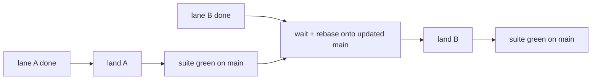

You have three features in flight, each in its own agent session, all in the
same repo. Git handles this fine — branches and worktrees have isolated
parallel working state for years. What breaks is **coordination**: which
session owns which plan, who writes which tracking file, and in what order N
finished branches integrate into `main`.

momentum's answer is the **lane**.

## Lanes

A **lane** is one concurrent workstream, made of three pieces:

| Piece | What it is |
|---|---|
| A **branch** | usually in its own worktree — the isolated git state |
| A **plan node** | the phase (or ad-hoc record) the branch is bound to |
| An **agent session** | the session working that branch, oriented by that plan |

One lane is just the normal momentum workflow — a phase on a branch. Lanes
matter when there's more than one: each session resolves its own phase from
its own branch, writes its own phase artifacts, and lands at the shared
integration point in a defined order.

The plan itself is a **recursive graph**:

```
ecosystem ⊃ repos ⊃ phases ⊃ tasks
```

Parallelism is legal at any node whose children are independent, and one
rule applies at every level: **independent siblings fan out; dependencies
form waves; everything lands sequentially at its integration point.** Two
independent phases in one repo run as two lanes landing on `main`. Two
independent repos in an ecosystem fan out the same way, landing into the
initiative. The integration point changes; the rule doesn't.

## Which phase is yours

With two sessions in one repo, "the active phase" stops being a single
thing. Each session resolves its own:

1. **Branch binding first.** Branch `phase-N-shortname` binds to directory
   `specs/phases/phase-N-shortname/`. If you're on `phase-7-auth`, your
   phase is `phase-7-auth` — regardless of what any other session is doing.
2. **`status.md` as fallback and overview.** The Active Phase table in
   `specs/status.md` holds **one row per active lane**
   (Phase | Branch | Status | Progress). Branches that don't bind to a
   phase directory — and detached HEAD — resolve through this table. It's
   also how any session sees what *else* is in flight.

Non-phase branches (`fix/*`, `feat/*`, `chore/*`) bind to the ad-hoc lane
(`specs/adhoc/`) — quick tasks and spikes get the same unambiguous ownership
without a phase scaffold.

The table is the board of record: add your row when a lane opens, update
only your row while it runs, mark it when it lands.

## Isolation: substrate by detection, never dependency

momentum deliberately does **not** manage worktrees, pools, or sessions —
that layer is solved, and solved well, by dedicated tools. momentum detects
and recommends; it never requires. Install stays `momentum init`, nothing
else.

**Plain `git worktree` is the zero-install default.** Two commands give a
second session its own working directory on its own branch:

```bash
git worktree add ../myapp-search phase-12-search
cd ../myapp-search   # open your second agent session here
```

Both directories share one repository — same history, same remotes, fully
independent working state.

**[treehouse](https://github.com/kunchenguid/treehouse)** — a worktree
*pool* manager — when cold starts hurt. Fresh worktrees start with empty
`node_modules` and cold build caches; treehouse keeps a pool of reusable
worktrees with warm caches, so a new lane is ready in seconds instead of
minutes.

**[GitButler](https://github.com/gitbutlerapp/gitbutler)** takes a different
route entirely: **virtual branches** apply N branches to one working
directory as lanes you can move changes between, with each agent session
pinned to a virtual branch. No worktrees at all — a genuinely different
answer to the same problem, and fully compatible with momentum's
conventions.

Pick whichever substrate fits. The lane model above is the same on all
three.

## Landing: main is the runway

Finished lanes don't merge whenever they feel ready — `main` is the runway,
and **one lane lands at a time**:

1. One lane merges (with the usual Rule 6 approval gate).
2. The full suite runs green on the updated `main` **before** the next
   landing.
3. Remaining lanes **rebase onto the updated `main`** before they land.
4. Stacked (dependent) lanes land parent-first; a child rebases onto its
   parent until the parent lands, then onto `main`.



Never land two lanes back-to-back without the suite passing in between. A
green suite on each lane's branch proves each lane works **alone**; only a
green suite on the updated `main` proves the *combination* works. Sequential
landings are the consensus practice across parallel-agent development for
exactly this reason — the merge point is where independent-looking changes
collide.

## Lane-scoped tracking

Concurrent lanes only stay sane if their writes don't collide. momentum's
spec layer splits cleanly:

| Files | Ownership | Rule |
|---|---|---|
| `specs/phases/<your-phase>/` — `tasks.md`, `history.md`, `evidence/` | **Your lane only** | Write freely — parallel-safe by construction, no other lane touches them |
| `specs/status.md`, `specs/backlog/backlog.md`, `specs/changelog/` | **Shared** | Append or touch your own row/line only — never reformat, renumber, or rewrite other lanes' entries |

Per-phase artifacts can't conflict because each lane has its own directory.
Shared files stay trivially mergeable as long as every lane adds its own
lines and leaves everyone else's alone. Cross-lane edits — fixing another
phase's `tasks.md`, updating another lane's status row — are off-limits from
inside a lane: tell the user or file a backlog item instead.

## Off-lane work

Not everything needs a lane. Two kinds of work are **off-lane** by design —
zero tracking contention:

- **Brainstorms** (`/brainstorm-idea`, `/brainstorm-phase` exploration)
  write no files at all until you approve a plan.
- **Spikes** — time-boxed, throwaway exploration — write only their own
  `specs/adhoc/<id>/` record.

Neither touches the Active Phase table. You can brainstorm the next phase
while three lanes run, with nothing to coordinate.

## What's coming

Everything above is shipped convention — it works today with any git setup.
The next steps of the Parallel Lanes arc add **mechanism**. Both are
**upcoming, not shipped**:

- **Run** — a lane registry with per-lane manifests, an ambient board
  (`momentum lanes`) any session can render — including queue pressure, so
  you see done-but-unlanded lanes piling up before trust erodes — and a
  merge queue with graded gates extending the git-hook enforcement layer.
- **Fly** — one recursive wave planner: dependency annotations on tasks and
  phases, waves computed at every level of the plan graph, with
  [swarm](/swarm/) as its top-scale consumer for cross-repo delivery.

Until then, the conventions on this page are the contract — and they're the
same conventions the mechanism will enforce.

**Related:** [Concepts](/concepts/) for phases and history ·
[Rules](/rules/) for the git lifecycle and tracking discipline ·
[Swarm](/swarm/) for multi-repo parallel delivery.
