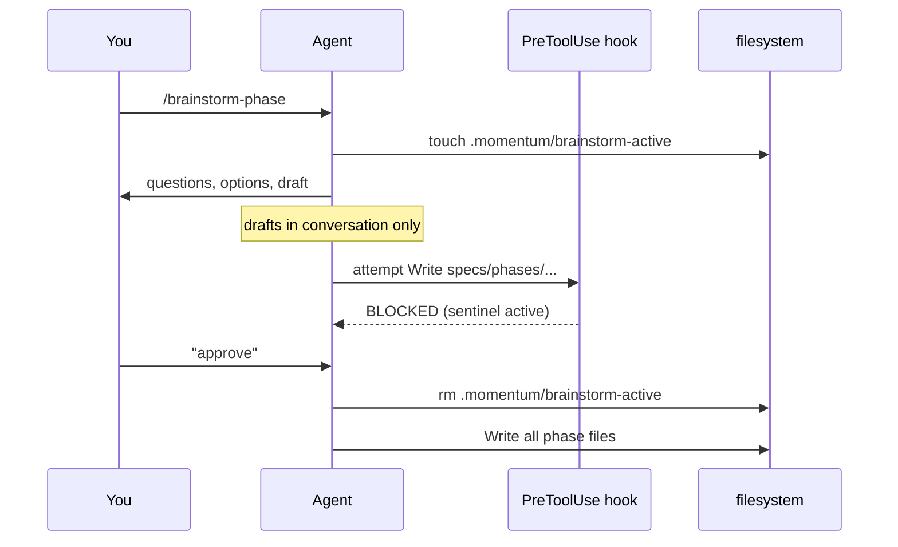

A **skill** is a slash command your agent runs to drive the momentum
workflow. They're not hidden behind a CLI — they're the *primary* surface
the agent uses while working.

Each skill lives as a markdown file under `core/commands/` (or per-agent
overlay under `adapters/<agent>/commands/`). When the agent loads its
instruction file at session start, it picks up every available skill and
knows when to invoke each.

Skills group by **lifecycle**: Project (rare, ~once per project), Phase
(every phase), Backlog (whenever), Cross-repo (only in ecosystem mode), and
Quality (review, debugging). The flat list of all skills below also tells
you which adapters ship each (most ship everywhere).

## Project lifecycle

Skills you run rarely — typically once per project.

### `/brainstorm-idea`

Explore any idea through structured dialogue. **Nothing gets written to
disk.** The output is a clear, structured summary you can act on.

```
> /brainstorm-idea

What's the core problem or opportunity?
> need to add memory to our agent platform

Who is this for? (user, system, team)
> ...
```

Use this when you have a vague idea and want to think it through before
committing to a project.
[→ source](https://github.com/avinash-singh-io/momentum/blob/main/core/commands/brainstorm-idea.md)

### `/start-project`

Scaffold a new project from a clear idea. Creates `specs/`, the primary
instruction file, agent rules, and hooks.

```
> /start-project

Project name? > memory-module
Primary agent? (claude-code / codex / antigravity)
> claude-code
...
```

Run after `/brainstorm-idea`. Idempotent against skip-if-exists.
[→ source](https://github.com/avinash-singh-io/momentum/blob/main/core/commands/start-project.md)

### `/migrate`

Onboard an existing project with a manual or outdated momentum-like
structure into proper momentum layout. Gap detection, skip-if-exists fill,
index reconciliation.
[→ source](https://github.com/avinash-singh-io/momentum/blob/main/core/commands/migrate.md)

### `/validate`

Check the spec-structure health of a momentum project. Index-first by
default; `--deep` for full scan.

```
> /validate

Reading specs/phases/index.json...
Checking active phase files... ✓
Backlog ID monotonicity... ✓
Status freshness... ⚠ Last Updated > 7 days ago
```

[→ source](https://github.com/avinash-singh-io/momentum/blob/main/core/commands/validate.md)

## Phase lifecycle

The core loop. Run these every phase.

### `/brainstorm-phase`

Plan the next phase through structured dialogue. **Blocked by the brainstorm
gate from writing to `specs/`** until you approve.



The brainstorm gate is a `.momentum/brainstorm-active` sentinel file the
PreToolUse hook checks before allowing any Write/Edit on `specs/` paths.
Visible safety — agent can't accidentally pre-commit to a half-finished
plan.
[→ source](https://github.com/avinash-singh-io/momentum/blob/main/core/commands/brainstorm-phase.md)

### `/start-phase`

Begin a new implementation phase. Creates the phase directory, branch, and
initial commit. Then **executes the plan autonomously** per the contract —
no per-group approval prompts, no "should I commit?" interruptions.

```
> /start-phase

Creating branch phase-13-site-polish...
Group 0: Mermaid tooling + baseline... ✓
Group 1: Landing rewrite... ✓
Group 2: Docs deepening... in progress
...
[Hard stop only at merge + release gate]
```

[→ source](https://github.com/avinash-singh-io/momentum/blob/main/core/commands/start-phase.md)

### `/sync-docs`

Apply pending history entries to other specs. Reads the active phase's
`history.md`, identifies which other docs need updating via topics + the
`Affects-specs:` field, applies the updates in one batch. Run at phase
completion, before `/complete-phase`.
[→ source](https://github.com/avinash-singh-io/momentum/blob/main/core/commands/sync-docs.md)

### `/complete-phase`

Verify, finalize, and release a completed phase.

```
> /complete-phase

Running verification:
  npm test         → 246/246 ✓
  linkinator       → 0 broken ✓
  lighthouse       → 98 / 96 / 100 / 100 ✓

Writing retrospective.md...
Updating status.md, index.json, README.md...
Bumping package.json: 0.15.0 → 0.16.0

Ready to tag v0.16.0 and npm publish? (y/N)
```

The verification step is non-optional — Rule 12 (Verify Before Claim)
enforces it. No release without fresh evidence captured in retrospective.md.
[→ source](https://github.com/avinash-singh-io/momentum/blob/main/core/commands/complete-phase.md)

### `/log`

Record a manual entry in the active phase history file. Use when the agent
missed something the user wants tracked. Drops you into a structured prompt
for the entry type, topics, and detail.
[→ source](https://github.com/avinash-singh-io/momentum/blob/main/core/commands/log.md)

## Backlog

### `/track`

Track a backlog item — bug, feature, tech debt, or enhancement. One command,
four item types.

```
> /track

Type? (bug / feature / tech-debt / enhancement)
> bug
Title? > momentum upgrade overwrites CLAUDE.md project title
Priority? (P0/P1/P2/P3) > P2
Context? > ...
```

Assigns the next ID in the chosen prefix, appends the row to backlog.md,
notifies you of the assignment.
[→ source](https://github.com/avinash-singh-io/momentum/blob/main/core/commands/track.md)

### `/review`

Review and groom the backlog between phases. Surfaces stale items, priority
drift, and missing context. Useful before `/brainstorm-phase` so the next
phase has clean inputs.
[→ source](https://github.com/avinash-singh-io/momentum/blob/main/core/commands/review.md)

## Cross-repo (ecosystem mode only)

These skills only activate in ecosystem mode. In single-project mode they're
no-ops or unavailable.

### `/ecosystem`

Cross-repo ecosystem coordination. Subcommands: `init`, `add`, `remove`,
`status`, `doctor`. Wraps the `momentum ecosystem` CLI with conversational
defaults.
[→ source](https://github.com/avinash-singh-io/momentum/blob/main/core/commands/ecosystem.md)

### `/initiative`

Manage cross-project initiatives. A single feature that spans more than one
member repo gets one initiative file at `<eco-root>/initiatives/NNNN-slug.md`.
[→ source](https://github.com/avinash-singh-io/momentum/blob/main/core/commands/initiative.md)

### `/session`

Append a manual narrative entry to today's ecosystem session log. Use when
something happened that's worth recording but isn't tied to a git commit or
PR.
[→ source](https://github.com/avinash-singh-io/momentum/blob/main/core/commands/session.md)

### `/scout`

Read-only context fetch from one ecosystem member repo. Returns a structured
summary; writes a scout artifact for later reference.
**[Deep dive →](/orchestration/#scout)**

### `/dispatch`

Parallel multi-project fan-out + synthesis. One sub-agent per listed repo with
auto-tailored prompts. Originating agent synthesizes the answer from the
structured results.
**[Deep dive →](/orchestration/#dispatch)**

### `/handoff`

Cross-session control transfer with a structured context block. Writes
`<toRepo>/.momentum/inbox/handoff-NNN.md`. The receiving session reads the
block first.
**[Deep dive →](/orchestration/#handoff)**

### `/continue`

Pick up a pending handoff in this repo. Reads the oldest `.momentum/inbox/
handoff-NNN.md`, parses the structured context, invokes the receiver flow.
Idempotent.
**[Deep dive →](/orchestration/#continue)**

## Quality + debugging

### `/review-code`

Multi-perspective code review of pending changes on the current branch.
Dispatches role-specific subagents (security, QA, architecture) in parallel.
Returns Critical / Important / Minor findings.
[→ source](https://github.com/avinash-singh-io/momentum/blob/main/core/commands/review-code.md)

### `/systematic-debug`

Systematically isolate, reproduce, and resolve task execution failures.
Walks a structured debugging protocol — minimal repro, hypothesis test, fix
isolated, regression check.
[→ source](https://github.com/avinash-singh-io/momentum/blob/main/core/commands/systematic-debug.md)

## Adding your own skills

Skills are plain markdown files in `core/commands/` (for cross-adapter) or
`adapters/<agent>/commands/` (for agent-specific). Each file has a short
header explaining when to use it, then the body describing the steps the
agent should follow.

The adapter contract handles where files install per agent. Authoring your
own skill is on the roadmap for Phase 16 (`/specify` + skill authoring) —
for now, write the markdown file directly and `momentum upgrade` won't
touch it (unmanaged files are preserved).
