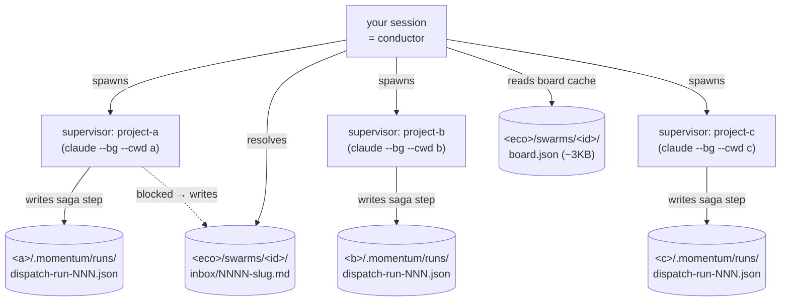

> **Tier 2 — sustained, dependency-ordered, multi-supervisor.** For one-shot moves across projects (audit, fan-out fix, control transfer), the lighter-weight [**Quick verbs**](/orchestration/) (`scout` / `dispatch` / `handoff` / `continue`) are usually what you want. Both tiers read and write the same foundation: **[ecosystem state](/ecosystem/)**.

A **swarm** is a declared cross-project work unit driven from ONE agent
session. Your session becomes the **conductor**. The conductor spawns
one **supervisor** subagent per impacted project, each pinned to that
project's working directory with its own fresh context. Each supervisor
runs momentum's normal `/start-phase` → implement → `/sync-docs` →
`/complete-phase` loop INSIDE its project.

The conductor coordinates **waves** (computed from `ecosystem.json`
dependency edges), surfaces inbox decisions, broadcasts cross-cutting
concerns, and synthesizes per-project retrospectives into the
initiative at fan-in.

Agents are stateless across turns; **state lives in files**. A swarm
survives session boundaries the same way a phase does — every
state-changing action writes to disk; `/swarm resume` reconstitutes
from disk.

> v0.20.0 ships **Claude Code only**. Codex + Antigravity parity is
> Phase 18 (v0.20.2). The `core/swarm/` library is platform-agnostic —
> only the spawn wiring is platform-specific.

## When to use a swarm

- A feature spans **two or more momentum-installed projects** AND has
  dependency ordering (e.g. frontend depends on backend depends on
  shared-types).
- You want ONE session driving the whole feature, not three serial
  sessions.
- An initiative exists or is about to exist at `<eco>/initiatives/<slug>.md`.

## When NOT to use a swarm

| You want… | Use this instead |
|---|---|
| Cross-project read-only audit | [`/dispatch`](/orchestration/#dispatch) |
| Single-project phase | `/start-phase` directly |
| Context transfer to another session | [`/handoff`](/orchestration/#handoff) |

## Architecture — files-as-channels, no daemon



| Layer | Owns | Reads |
|---|---|---|
| **Conductor** (your session) | `<eco>/swarms/<id>/manifest.json` + `board.json` + `contracts/` + `inbox/` + `signals/` + `changes/` | Per-supervisor `dispatch-run-<id>.json` (status only) |
| **Supervisor** (per project) | `<project>/specs/phases/.../*` + `<project>/.momentum/runs/dispatch-run-<id>.json` | Its phase brief + contract + history.md tail |

No daemon. No message broker. No server. Just files in the ecosystem
project, with the same `mkdir`-lock pattern `session-append.sh`
already uses for race-safe writes.

## Indexing — the load-bearing efficiency design

Without indexing, a 200-turn × 5-project swarm consumes ~60M tokens
($50–100). Four layered strategies cut that 95%:

| Strategy | Mechanism | Win |
|---|---|---|
| **A** Materialized board cache | `board.json` regenerated on every manifest write; conductor reads ONLY this | ~290KB → ~3KB per turn |
| **B** Git HEAD SHA invalidation | Per-project `last_seen_sha` cheaply revalidated via `git rev-parse HEAD` | Unchanged projects skip refresh |
| **C** Incremental log + history tail | `.offsets.json` tracks byte offsets; never re-read full `history.md` | <500B typical delta |
| **D** Supervisor context isolation | cwd-pinned spawn; conductor NEVER loads supervisor context | Bounded per-supervisor cost |

End-to-end scenario evidence (3-project linear, 4-project diamond,
5-project wide fan-out): p95 conductor-turn cost **800–1200 bytes**
across all three. Target was <5KB.

## Three modes

| Mode | Behavior | When to pick |
|---|---|---|
| `checkpoint` (default) | Plan approval + wave-boundary approval; inbox surfaces during waves | First runs, multi-team coordination, anything with significant risk |
| `autopilot` | Plan approval only; auto-advance through all waves; inbox auto-halts the supervisor that raised it | Trusted runs, internal refactors, contract-stable changes |
| `interactive` | Every supervisor task surfaces for approval before execution | **Deferred to v0.20.x** (UI complexity) |

Mode is set per-swarm at `/swarm start` and stored in the manifest.

## Eight intervention patterns

v0.20.0 ships 5 of 8. The remaining 3 are scoped for v0.20.x.

| Pattern | Shipped | How |
|---|---|---|
| 1. Pre-flight plan approval | ✓ v0.20.0 | `/swarm start` renders plan; you approve before spawn |
| 2. Wave checkpoint | ✓ v0.20.0 | Between waves in `checkpoint` mode |
| 3. Mid-flight question (inbox) | ✓ v0.20.0 | Supervisor writes `inbox/NNNN-<slug>.md`; conductor surfaces |
| 4. Context push (`/swarm tell`) | ✓ v0.20.0 | Appends to one supervisor's `swarm-context.md` |
| 5. Broadcast | ✓ v0.20.0 | Appends to every supervisor's `swarm-context.md` |
| 6. Discuss thread | v0.20.x | Sustained sub-chat with one supervisor |
| 7. Manual takeover (pause/resume) | v0.20.x | Pause one supervisor without halting the swarm |
| 8. Rewind | v0.20.x | Revert one supervisor to a known-good state |

## Subcommands

Both `/swarm` (Claude Code slash) and `momentum swarm` (CLI) produce
the same on-disk artifacts. Use whichever door fits the moment.

### `/swarm start <slug> --initiative <slug> --repos r1,r2,... --phase <phase-slug> [--mode checkpoint|autopilot]`

Plan + spawn Wave 1. Default is dry-run (prints the spawn directives).
Pass `--spawn` to actually launch `claude --bg --cwd` background
sessions per Wave 1 project.

```bash
momentum swarm start user-auth \
  --initiative user-auth \
  --repos shared-types,backend,frontend \
  --phase phase-3-user-auth \
  --mode checkpoint \
  --spawn
```

### `/swarm status <swarm-id>`

Render the materialized board cache (~3KB). Pass `--json` for
machine-readable.

### `/swarm tell <swarm-id> <repo> "<text>"`

Append a note to one supervisor's `swarm-context.md`. Use for
project-specific clarifications.

### `/swarm broadcast <swarm-id> "<text>"`

Append a note to every supervisor's `swarm-context.md`. Use for
swarm-wide constraints.

### `/swarm inbox list <swarm-id>` / `write` / `resolve`

Inbox protocol. Supervisor writes when blocked; conductor surfaces;
you answer.

### `/swarm verify <swarm-id>`

Contract verifier + initiative back-reference + brief frontmatter
check. Returns exit code 0 = OK, non-zero = issues to resolve.

### `/swarm preview-merge <swarm-id>`

Run `git merge --no-commit --no-ff` for every supervisor branch
against `main`; surface conflicts as inbox items. Always aborts — no
actual merge.

### `/swarm budget <swarm-id> <repo> +N | -N`

Extend or contract a supervisor's token budget. Default is 300k per
supervisor.

### `/swarm complete <swarm-id>`

Synthesize per-project retrospectives into the initiative's
`Per-repo contributions` section; write cross-project changeset to
`<eco>/changes/<id>.md`.

### `/swarm resume <swarm-id> [--session <id>]`

Reattach a session to an existing swarm. Disk-only reconstitution —
no in-memory state required. Survives kill-9.

### `/swarm cancel <swarm-id> [--reason "<text>"]`

Graceful halt. Halts every supervisor; preserves all artifacts
(branches NOT force-pushed or deleted) for forensics.

## Worked example — 3-project linear feature

```bash
# Plan + spawn Wave 1 (shared-types)
momentum swarm start payments \
  --initiative payments \
  --repos shared-types,backend,frontend \
  --phase phase-7-payments \
  --mode checkpoint \
  --spawn

# After Wave 1 supervisor reports done:
momentum swarm status 0001-payments
# (checkpoint pauses here; user approves Wave 2)

# At completion:
momentum swarm verify 0001-payments
momentum swarm preview-merge 0001-payments
momentum swarm complete 0001-payments
```

## Recovering after a session kill

```bash
# Session 1 killed mid-Wave 2; session 2 reattaches:
momentum swarm resume 0001-payments --session sess_new
# Conductor reads manifest + board + offsets from disk; continues the poll loop.
```

## What's next (Phase 17.5 — v0.20.1)

v0.20.0 bakes in the schema hooks for forward-compatible portability.
v0.20.1 (Phase 17.5) will light up three commands:

| Command | Scenario |
|---|---|
| `/swarm focus <repo>` | Split a running swarm into a focused side-session — one supervisor moves to a new conductor; the rest stay with the original |
| `/swarm join <swarm-id>` | Join an independent session to an existing swarm as a co-conductor |
| `/swarm absorb <other-id>` | Converge multiple swarms back into one — `/swarm verify` checks contract compatibility before allowing the merge |

The schema hooks are already present in v0.20.0 — `repos[*].owner`,
`lease_expires_at`, `lease_renewed_at`, `claimed_by_session`,
top-level `sessions[]`, reserved `signals/` + `tokens/` directories.
v0.20.0 always sets `owner = current session`; v0.20.1 turns lease
enforcement on without any schema migration.

## Troubleshooting

| Symptom | Likely cause | Fix |
|---|---|---|
| `cannot locate ecosystem root` | You're outside an ecosystem | Pass `--ecosystem <path>` or `cd` into one |
| `claude --bg not on PATH` | Claude Code binary missing or older | Update Claude Code; or use dry-run + manual spawn |
| Cycle detected at `swarm start` | `ecosystem.json` has a dependency cycle in your impacted set | Fix `ecosystem.json`; or split the cycle into two swarms |
| Pre-merge surfaced conflicts | Two waves changed overlapping code | Resolve manually before the real merge; rerun verify |
| Inbox item never closed | Supervisor halted waiting | `/swarm inbox resolve <id> --answer "..."` |

## Related

- [Ecosystem mode](/ecosystem/) — the state layer that swarm reads
- [Orchestration](/orchestration/) — scout / dispatch / handoff / continue, the lighter-weight cross-project verbs
- [Concepts](/concepts/) — phases, initiatives, history, the building blocks swarm composes
